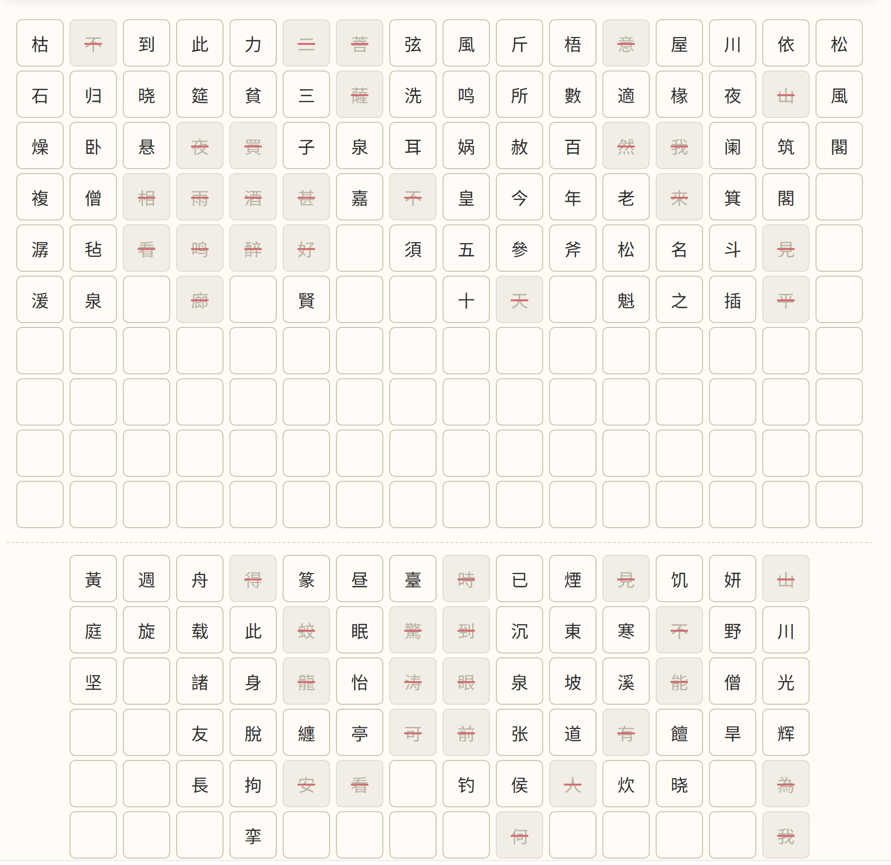

# 选字组词 · Chinese Word Composer

> 一个交互式 HTML 工具，用于从竖排文本（如碑帖拓片、古诗文）中选取汉字并组合成词语。支持简繁查找、横排转竖排，纯前端，无需任何依赖。

## 功能

| 功能 | 说明 |
|------|------|
| **竖排文字网格** | 输入的多行文本以传统竖排（从右到左）方式展示，每个汉字为独立可点击按钮 |
| **选字组词** | 点击汉字选中 → 确认组词 → 已选字标记删除线，可连续组多个词 |
| **词条管理** | 所有已组词以 Chip 形式展示，支持逐个删除，一键复制为纯文本 |
| **简繁查找** | 浮动搜索框输入文字，自动高亮匹配项（不分简繁，如「阁」同时匹配简体和繁体） |
| **横排转竖排** | 两种方式：自动分列（按列数/字数切分）或回车分割（每行成一列） |
| **简→繁转换** | 一键将输入文本转为繁体字，内置约 2900 组简繁映射 |

## 快速开始

直接用浏览器打开 `word-composer.html` 即可使用，无需安装任何依赖或启动服务器。

```
open word-composer.html      # macOS
start word-composer.html     # Windows
xdg-open word-composer.html  # Linux
```

## 使用流程

```
① 输入文本 ──→ ② 点击选字 ──→ ③ 确认组词 ──→ ④ 复制结果
```

**详细步骤：**

1. **输入文本** — 在底部「横排转竖排」区域粘贴文本，点击「自动分列」或「直接上墙」
2. **查找汉字** — 用顶部搜索框输入文字，网格中自动高亮匹配的汉字
3. **选字组词** — 点击竖排中的汉字（支持多选），点击「确认组词」
4. **管理词条** — 已组词语显示在中间区域，可逐条删除或一键复制

## 示例

输入以下文本（用回车分行）：
```
松风阁
依山筑阁见平川，夜阑箕斗
夜阑箕斗插屋椽
```

点击「直接上墙」→ 三列竖排显示，即可开始选字组词。

## 输入格式

工具核心数据格式为二维数组，每行是一个字符串数组（代表竖排中的一列）：

```json
[
  ["低", "头", "思", "故", "乡"],
  ["举", "头", "望", "明", "月"],
  ["疑", "似", "地", "上", "光"]
]
```

## 技术说明

- **纯前端** — 单 HTML 文件，零依赖，零服务器要求
- **简繁映射** — 内置约 2900 组简繁汉字对照表，支持简繁双向查找
- **模块化 JS** — 代码分为 `AppState`、`GridRenderer`、`SelectionMgr`、`WordsManager`、`Converter`、`UIController` 六个模块
- **响应式** — 适配桌面和移动端，超过 16 列自动折行

## 文件结构

```
word-composer.html     # 主程序（全部功能）
README.md              # 本文件
```

## 许可

MIT
